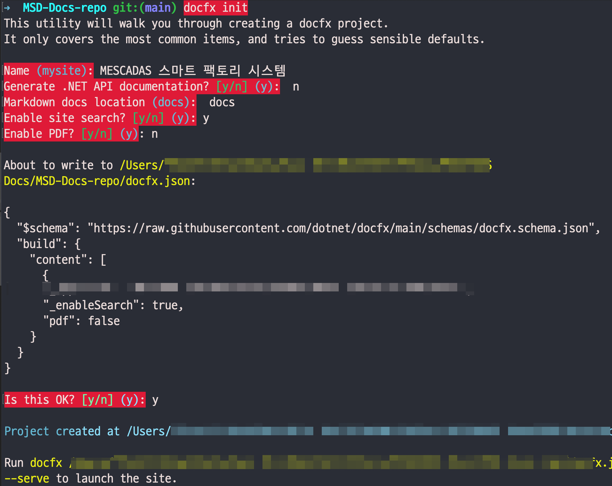
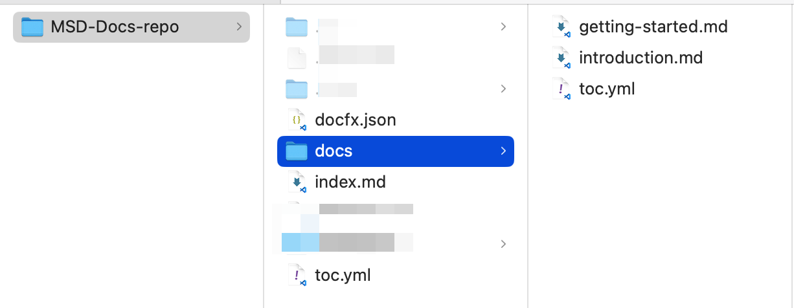

# DocFX

* <a href="https://dotnet.github.io/docfx/docs/basic-concepts.html" target="_blank">DocFX 공식 가이드</a>
* <a href="https://github.com/dotnet/docfx" target="_blank">DocFX 공식 소스코드 (Github)</a>

DocFX는 C# 기반의 오픈 소스 **정적 사이트(Static Web files) 생성기**로, 일반적인 Markdown 파일을 기반으로 프로그래밍 가이드등의 문서를 손쉽게 작성할 수 있으며, 특히 .NET 프로젝트의 API 문서화를 위해 사용됩니다. 

정적 사이트 생성기라는 프로그램 범주에는 Vitepress등 수 많은 것들이 있습니다만, 

Microsoft의 <a href="https://dotnet.github.io/docfx/index.html" target="_blank">DocFX 공식 가이드</a> 깃헙 페이지 또한 DocFX로 생성된 정적 사이트입니다. 이 처럼 Top Nav Bar와 목차(TOC) 사이드바, 문서검색 레이아웃이  있는 문서사이트를 손쉽게 만들고 업데이트 할 수 있습니다.

## 문서 작성 형식
- 기본적으로 DocFX는 표준 Markdown(.md) 파일을 사용합니다.
- Markdown은 YAML 헤더를 포함할 수 있으며, YAML 헤더에서 페이지 메타데이터를 정의합니다:

``` markdown
---
title: My Custom Page
description: This is a custom DocFX page.
---
# Welcome to My Documentation
```

DocFX는 표준 Markdown 외에도 DocFX 확장 문법을 지원합니다. 예를 들어:
- `<xref>` 태그를 사용해 API 참조를 추가.
- `@import` 문법으로 다른 파일을 포함.

``` markdown
<xref:System.String>
```

## 플러그인 개발
  - DocFX는 ** C# **으로 작성되었으며, 플러그인 또한 C#으로 개발합니다.
  - DocFX 플러그인은 다음과 같은 작업을 커스터마이징할 수 있습니다:
	1.	**Markdown 파서**: Markdown 파일을 커스터마이징하여 확장 기능을 추가 가능.
	2.	**Template:** HTML 레이아웃 및 렌더링 과정을 수정 가능.
	3.	**Post Processor**: 최종 HTML 출력 후 추가 작업 가능.
	4.	**Metadata**: 소스 코드에서 API 메타데이터를 수집하는 방식을 변경 가능.

예를 들어, Markdown에 특별한 태그를 추가하려면 플러그인을 작성해 해당 태그를 HTML로 변환할 수 있습니다.
``` csharp
[Export(typeof(IMarkdownTokenValidatorProvider))]
public class CustomValidator : IMarkdownTokenValidatorProvider
{
    public IEnumerable<IMarkdownTokenValidator> GetValidators()
    {
        return new List<IMarkdownTokenValidator>
        {
            new YourCustomValidator()
        };
    }
}
```


## DocFX 설치
<a href="https://dotnet.github.io/docfx/index.html" target="_blank">DocFX 공식 Quick Start 가이드</a>에 따르면, 

- CLI 명령어에 익숙한 개발자
- .NET SDK 8.0 이상 설치 환경
- (선택사항) Node.js v20 이상 설치 환경 (PDF 파일로 변환용)

이 요구됩니다.

또한 정전문서로 빌드를 위해 CLI에서 `dotnet` 명령어로 설치할 수 있는 `docfx` .NET Global Tool을 설치해야합니다.
> 참고: `dotnet` 명령어는 .NET SDK 를 설치하면 기본적으로 이용가능하며, `dotnet tool` 명령어로 설치가능한 .NET Global Tool들은 다른 여러 개발도구 명령어를 설치할 수 있게 해주는 툴셋을 일컫습니다. 여러 .NET Global Tool들은 Nuget 등을 통해 설치되며 MS 공식이거나 다른 개발자가 제작한 도구일 수 있습니다. 

## docfx 설치/업데이트
자신의 컴퓨터에 닷넷 SDK가 설치된 닷넷 개발자라면 .NET Global Tool(`dotnet tool`)을 바로 사용할 수 있습니다.

### 설치
 **터미널 에뮬레이터**(CLI 환경 Shell 명령어 프로그램)에서:
~~~
dotnet tool install -g docfx
~~~
위 명령어는 DocFX를 글로벌로 설치하며, 설치 후 docfx 명령어를 사용할 수 있습니다.
- 설치가 완료되면 $HOME/.dotnet/tools가 PATH 환경 변수에 포함되어 있는지 확인하세요.
- 포함되어 있지 않다면, 다음을 .zshrc 또는 .bash_profile에 추가하세요:
  ~~~
  export PATH=$PATH:$HOME/.dotnet/tools
  ~~~

### 업데이트:
~~~
dotnet tool update -g docfx
~~~


## docfx init - DocFX 프로젝트 생성 및 프로젝트 구조
프로젝트를 초기화할 때 `docfx init` 명령어를 사용합니다. 

원하는 폴더를 DocFX 프로젝트 디렉토리(working directory)로 만들려면 원하는 폴더 위치에서:
~~~
docfx init
~~~

`docfx init`을 실행하면 다음과 같은 기본 폴더와 파일이 생성됩니다:
- docfx.json:
    - DocFX의 기본 구성 파일로, 빌드와 문서화에 필요한 설정이 포함됩니다.
        - Node.js 패키지의 package.json과 같은 구성 파일입니다.
    - 소스 코드 경로, 출력 경로, 템플릿, API 문서화 경로, 플러그인 확장 기능 정의 등을 설정합니다.
- api/ 폴더:
    - 소스 코드의 API 문서를 생성하는 데 필요한 파일이 들어갑니다.
- articles/ 폴더:
    - 일반적인 문서를 작성할 수 있는 Markdown 파일이 포함됩니다.
- toc.yml:
    - Table of Contents(목차)를 정의합니다.
- index.md:
    - 문서의 기본 페이지를 정의합니다 (홈/루트/랜딩 페이지같은 이름으로 불리기도 합니다.)

`docfx init` 실행시 질문답변에 따라 `docfx.json`의 내용을 구성해줍니다:



- Name: 
  - 사이트 타이틀
- Generate .NET API documentation?:
  - C# .NET 프로젝트의 Class/Method API 문서 생성여부.닷넷 프로젝트일경우 API 문서 페이지 또한 구성하려면 `y` 입력.  `n` 선택 후 차후 직접 구성가능.
- Enable site search?:
  - 문서 사이트의 검색 기능 추가 하려면 `y` 선택
- Enable PDF?:  **Node.js 환경 필요**
  - 다운로드 가능한 PDF 파일 생성 기능 활성화 여부. `y` 선택시 PDF 관련 설정이 추가
  - 내부적으로 wkhtmltopdf라는 도구사용:
    1.	HTML 문서를 기반으로 PDF 변환.
	2.	변환된 PDF 파일이 지정된 출력 폴더에 생성됨.

다음과같은 구조가 됩니다:


git root가아닌, 다른 곳 DocFX 프로젝트를 생성하고 싶다면 별도의 폴더를 만들어 그 경로를 지정하여 `docfx init`을 실행하면 됩니다.
~~~
mkdir DocFX
cd DocFx
docfx init
~~~


## toc.yml
사이트 목차는 YAML 파일(.yml)로 관리됩니다. `docfx init`후 두 위치에서 `toc.yml` 파일을 볼 수 있습니다.

- 워킹 디렉토리 루트의 toc.yml
  - 루트의 toc.yml은 **사이트의 전역 목차(Table of Contents)**를 정의하는 파일입니다.
  -	이 파일은 사이트의 최상위 계층을 관리하며, 주로 전체 사이트의 구조를 정의합니다.
  -보통은 주요 섹션이나 폴더(예: API 문서, 일반 문서 등)를 나열하는 데 사용됩니다.

- docs 디렉토리의 toc.yml
  - docs 폴더 안의 toc.yml은 하위 섹션의 목차를 정의하는 파일입니다.
  - 이 파일은 docs 폴더 내부의 Markdown 파일들을 어떻게 구성할지 설정합니다.
  - docfx.json에서 build.content로 지정한 경로에 따라, 이 파일이 빌드 시 각 Markdown 파일의 계층 구조를 정의하는 데 사용됩니다.

## 빌드 & 런
DocFX로 빌드하면 init 당시 지정한 폴더(`docs`) 하위의 `.md` 파일들을 html로 변환하여 `_site` 폴더를 생성합니다.

docfx.json 파일 위치를 지정해서 `--serve` 명령어옵션을 사용합니다.

> `docfx {/경로/docfx.json} --serve`

그러므로 docfx.json 파일이 위치한 프로젝트 워킹 디렉토리에서는 다음처럼 입력합니다:
~~~
docfx docfx.json --serve
~~~

> 본 레포지토리처럼 git root가 아닌 별도의 폴더(DocFX)안에서 만들었다면 다음처럼 경로를 포함하거나 이동해서 빌드&런을 실행합다
> ```
> docfx DocFX/docfx.json --serve
> ```


이 명령어는 다음 작업을 수행합니다:
1.	문서 빌드:
    - docfx.json에 정의된 설정을 기반으로 소스 파일(Markdown, 코드 주석 등)을 읽어 HTML 문서로 빌드합니다.
    - 빌드된 결과는 docfx.json의 `build.dest`에 정의된 디렉터리(기본값: `_site`)에 저장됩니다.
2.	로컬 서버 실행:
    - 빌드된 HTML 문서를 로컬 웹 서버에서 바로 볼 수 있도록 실행합니다.
    - 기본적으로 [http://localhost:8080](http://localhost:8080)에서 빌드된 문서를 확인할 수 있습니다.


init 직후에는  DocFX가 만드는 기본 페이지 두가지 레이아웃만 구성되어있습니다. 사이트 루트인 홈페이지(`/index.html`)와 문서페이지(`/docs/ 하위`) 레이아웃이 그것입니다.

이러한 사이트 레이아웃과 내비게이션 메뉴바, 검색박스등은 테마와 템플릿으로 구성되며 커스텀 레이아웃으로 직접 구성할 수도 있습니다.


## 배포
빌드된 결과물 (`_site` 폴더 내용물)을 Github Pages 또는 S3, 웹서버가 설치된  서버등에 배포하면 됩니다.

## 의존성 관리

DocFX는 C# 프로젝트와 통합되어 사용할 수 있으며, C# API 문서화를 위해서는 XML 주석 파일을 생성해야 합니다. XML 주석 파일을 활성화하려면 닷넷 프로젝트 파일(.csproj)에 다음 설정을 추가하세요:
~~~ xml (.csproj)
<PropertyGroup>
  <GenerateDocumentationFile>true</GenerateDocumentationFile>
</PropertyGroup>
~~~
